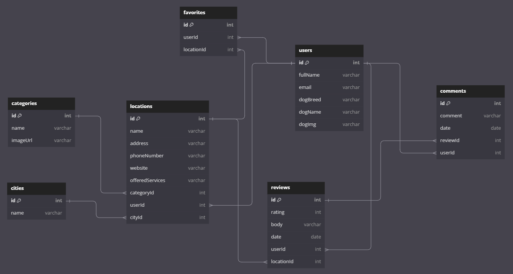
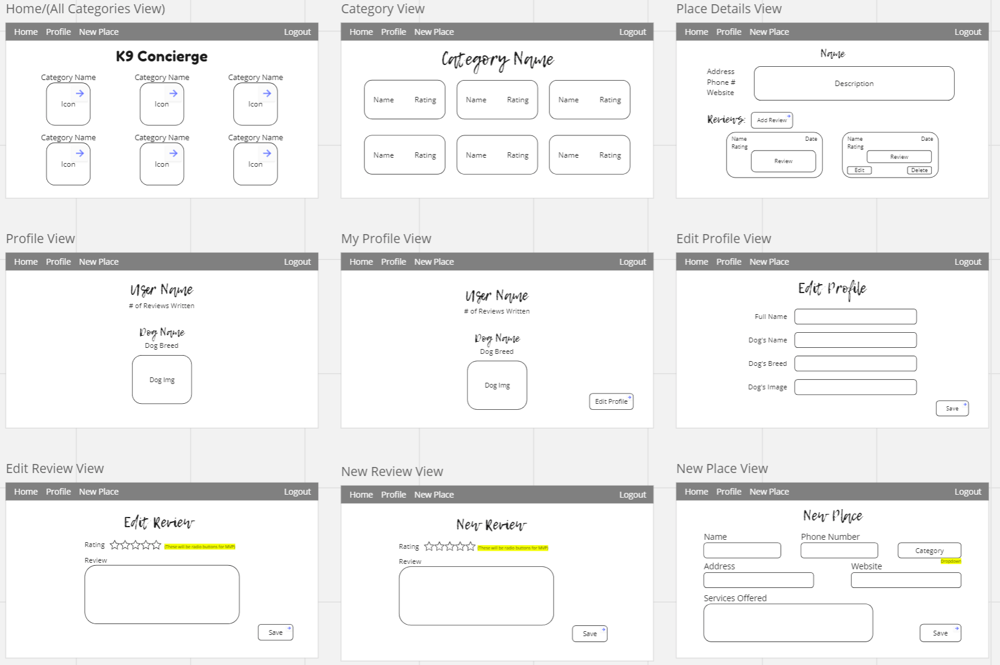

# K9 Concierge

> a locator for all things a dog owner would need

## The Idea

As a dog owner, whenever I end up in a new city and need to locate all the necessities for my dog, I'm always searching for a vet or a place to board my dog individually. I wanted to create an app that had everything in one place so I could quickly find top rated locations for anything I might need for my dog.

## Features

This app allows dog owners to locate vets, boarding, parks, pet stores, groomers, and dog bakeries all in one place. <br />
Features include:

- Any user can create a new location for one of the six categories
- Any user can leave a rating on a location
- Any user can leave a comment on another user's rating
- A profile page that shows the user's name, information about their dog, and how many ratings they've left
- A favorite page where users can quickly find all the locations they love
- The ability to sort by different cities as well as by different categories
- Anything a user can create they can also edit or delete with the exception of the location itself.

## ERD



## Wireframe

This was the initial wireframe to meet MVP: <br />


## Running This Application

1. Clone this repository

```sh
git clone git@github.com:triciaswift/k9-concierge.git
cd k9-concierge
```

2. Access the data
   https://github.com/triciaswift/k9-api

3. Launch the client.

```sh
npm install
npm start
```

### Demo User Credentials

<p>
Email: hermione_granger@gryffindor.com <br />
</p>
